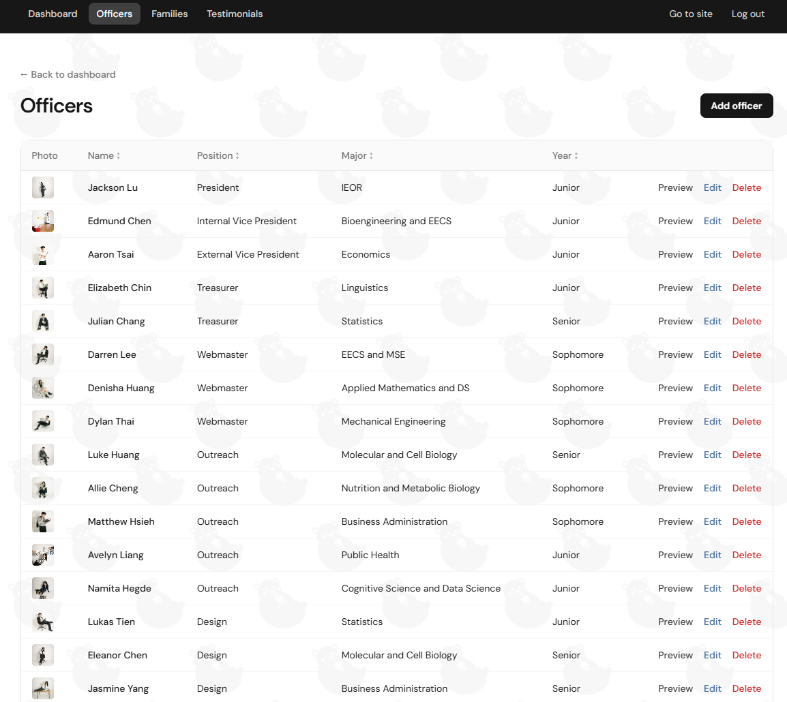
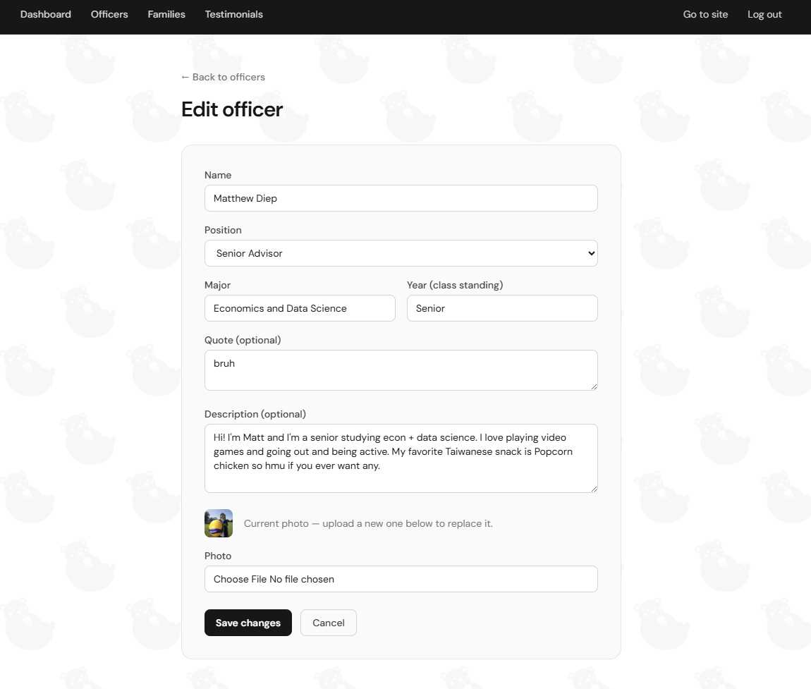

# TASA Website

This repo contains the source code for the UC Berkeley Taiwanese American Student Association website.
It is currently hosted by the Open Computing Facility (OCF).

## Conventions

- Don't do `git add .` or `git add -A`, just `git add -u` to only add changes for tracked files.
- Don't track files that contain sensitive information such as secret keys or passwords. Those go in
  `.env`, which is gitignored.
- Try not to edit on the live server, because that is bad.
- Don't drop a bunch of tables in the SQLite database.

## Developer setup

Here is how to set up a local version of the website on your own machine.

1. Clone the repository using git.
2. Create your virtualenv with `make venv` (on Windows: `py -m venv venv` then
   `venv\Scripts\pip install -e ".[dev]"`).
3. Make a file called `.env` at the repo root, like the `.env.example` file. Put in a `SECRET_KEY`, an
   admin username, and an admin password hash (generate the hash with `flask hash-password`). These are
   only active for your local running instance.
4. Create the database with `flask init-db`.
5. `make run` (on Windows: `python run.py`) to start everything locally. You should be able to view your
   site at http://localhost:5001.

## Using the site

It's pretty easy to do regular updates with the site.

Log in at `<site_url>/login` and you will get to the admin panel:

Each pane does exactly what you'd think. For officers, families, and testimonials you can add, update,
or delete entries — changes show up on the live site immediately, no redeploy needed. Clicking **Edit**
opens a handy form like this:

Home and About page photos are hand-placed files in `tasa_website/static/images/site/` — drop in a
correctly named image and it appears (a gray placeholder shows until then).

For full setup, content, and deployment details, see [MAINTAINING.md](MAINTAINING.md).

Have fun and don't forget to add your own cool features!
